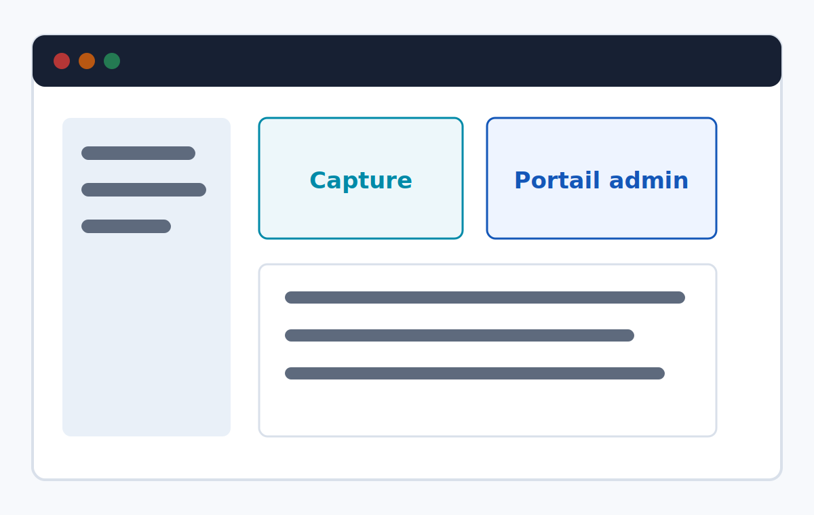
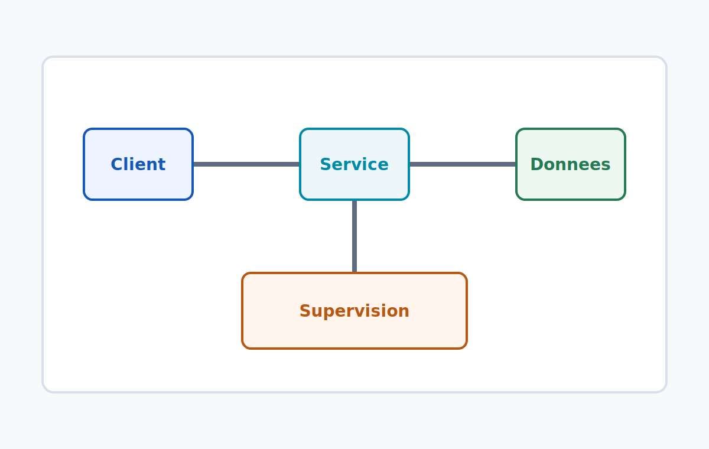
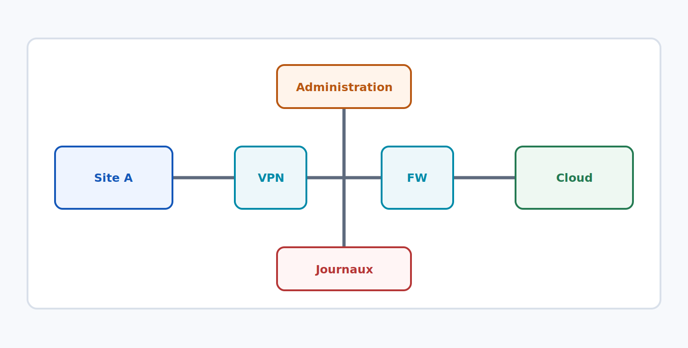

<!-- _class: cover -->
<!-- _paginate: false -->
<!-- _header: "" -->
<!-- _footer: "" -->

# {{COURSE_TITLE}}

{{COURSE_SUBTITLE}}

Auteur : {{AUTHOR}}

---

<!-- _class: objectives -->

# Objectifs pédagogiques

- Identifier les services et composants importants.
- Configurer un environnement de test reproductible.
- Diagnostiquer les erreurs courantes avec une méthode fiable.
- Appliquer les bonnes pratiques de sécurité et d'exploitation.

---

<!-- _class: summary -->

# Sommaire

1. Concepts et vocabulaire
2. Architecture cible
3. Configuration pas à pas
4. Démonstration guidée
5. Travaux pratiques
6. Validation et dépannage

---

<!-- _class: module -->

<div class="eyebrow">Module 01</div>

# Fondations techniques

Comprendre le contexte, les dépendances et les points de vigilance avant de configurer.

---

<!-- _class: section -->

<div class="eyebrow">Chapitre 01</div>

# Architecture de référence

Lecture du schéma, identification des flux et rôle des composants.

---

<!-- _class: tp -->

<div class="eyebrow">Travaux pratiques</div>

# Déployer un environnement de test

Objectif : obtenir une configuration fonctionnelle, documentée et reproductible.

---

<!-- _class: demo -->

<div class="eyebrow">Démonstration</div>

# Diagnostic d'un incident courant

Observation, hypothèse, vérification, correction et validation.

---

<!-- _class: content -->

# Slide de contenu simple

Un gabarit sobre pour expliquer une notion technique avec quelques points clés.

- Contexte et prérequis
- Séquence d'actions
- Résultat attendu
- Points de contrôle

> Utiliser ce format pour les explications courtes et les transitions.

---

<!-- _class: two-columns -->

# Deux colonnes

<div class="grid columns">
<div>

## Avant configuration

- Inventorier les prérequis.
- Vérifier les droits.
- Identifier les dépendances.

</div>
<div>

## Après configuration

- Tester les accès.
- Contrôler les journaux.
- Documenter les écarts.

</div>
</div>

---

<!-- _class: media-right -->

# Texte à gauche, visuel à droite

<div class="grid">
<div>

## Points d'attention

- Le visuel illustre le résultat attendu.
- Les captures conservent leurs proportions.
- Les annotations doivent rester lisibles.

</div>
<div class="visual-frame">



</div>
</div>

---

<!-- _class: media-left -->

# Visuel à gauche, texte à droite

<div class="grid">
<div class="visual-frame">



</div>
<div>

## Lecture du schéma

- Identifier les zones.
- Suivre les flux.
- Repérer les points de contrôle.

</div>
</div>

---

<!-- _class: text-table -->

# Texte et tableau

<div class="grid">
<div>

## Choisir le bon outil

Comparer les options selon le contexte, les contraintes de sécurité et le niveau d'automatisation attendu.

</div>
<div>

| Besoin | Outil | Remarque |
|---|---|---|
| Script local | PowerShell | Rapide et auditable |
| Infra as code | Terraform | Reproductible |
| Supervision | Logs | Validation continue |

</div>
</div>

---

<!-- _class: full-table -->

# Tableau pleine largeur

| Domaine | Exemple | Point de vigilance | Validation |
|---|---|---|---|
| Identité | Microsoft Entra ID | MFA et rôles privilégiés | Test de connexion |
| Réseau | Routage et DNS | Résolution et filtrage | `nslookup`, `tracert` |
| Système | Linux / Windows Server | Correctifs et durcissement | Baseline de sécurité |
| Cloud | Azure / AWS | IAM et coûts | Revue des permissions |

---

<!-- _class: full-visual -->

# Visuel pleine largeur

<div class="visual-frame">



</div>

---

<!-- _class: code -->

# Extrait de code ou commande

```powershell
$resourceGroup = "rg-formation-demo"
$location = "westeurope"

az group create `
  --name $resourceGroup `
  --location $location

az group show --name $resourceGroup --query "{name:name, location:location}"
```

---

<!-- _class: content compact -->

# Classe utilitaire `compact`

Pour les listes denses, matrices de ports, tableaux de prérequis ou checklists de validation.

| Contrôle | Commande | Résultat attendu |
|---|---|---|
| DNS | `nslookup portail.contoso.local` | Résolution correcte |
| Réseau | `Test-NetConnection -Port 443` | Connexion établie |
| Identité | `whoami /groups` | Groupe attendu présent |
| Service | `Get-Service WinRM` | Service démarré |
| Journaux | Observateur d'événements | Aucun blocage critique |

---

<!-- _class: content no-logo -->

# Classe utilitaire `no-logo`

Cette variante masque le logo compact pour laisser respirer une slide très visuelle, une consigne d'examen ou une capture déjà chargée.

<div class="callout">

Le footer et la pagination restent disponibles. Seul le logo compact est masqué.

</div>

---

<!-- _class: media-right media-wide -->

# Classe utilitaire `media-wide`

<div class="grid">
<div>

## Plus de place au visuel

- Utile pour une capture d'écran.
- Pratique pour un schéma d'architecture.
- Le texte reste court et ciblé.

</div>
<div class="visual-frame">


</div>
</div>

---

<!-- _class: media-right screenshot-wide no-logo -->

# Classe utilitaire `screenshot-wide`

<div class="grid">
<div>

## Texte court

- Pour les captures où le texte sert surtout de légende.
- Le visuel devient prioritaire sans supprimer la colonne texte.

</div>
<div class="visual-frame">


</div>
</div>

---

<!-- _class: media-right tight -->

# Variante `tight` avec capture

<div class="grid">
<div>

## Capture plus grande

- Marges réduites pour les screenshots.
- Colonnes plus proches.
- Cadre visuel agrandi.

</div>
<div class="visual-frame">


</div>
</div>

---

<!-- _class: media-right media-narrow -->

# Classe utilitaire `media-narrow`

<div class="grid">
<div>

## Plus de place au texte

- Conserver une illustration de contexte.
- Détailler les étapes importantes.
- Éviter une capture trop dominante lorsque l'explication prime.

</div>
<div class="visual-frame">


</div>
</div>

---

<!-- _class: full-visual tight -->

# Variante `tight` en pleine largeur

<div class="visual-frame">


</div>

---

<!-- _class: two-columns -->

# Deux captures côte à côte

<div class="grid columns">
<div class="visual-frame">


</div>
<div class="visual-frame">


</div>
</div>

---

<!-- _class: caption-bottom -->

# Texte en haut, capture en bas

- L'interface s'ouvre sur le tableau de bord principal.
- Vérifier que le statut affiché correspond à l'état attendu.

<div class="visual-frame">


</div>

---

<!-- _class: caption-bottom -->

# Texte en haut, deux captures en bas

- Comparer les deux états côte à côte pour valider la configuration.

<div class="grid columns">
<div class="visual-frame">


</div>
<div class="visual-frame">


</div>
</div>

---

<!-- _class: media-right screenshot-wide no-logo -->

# Texte + deux captures empilées

<div class="grid">
<div>

## Procédure en deux étapes

1. Ouvrir le portail d'administration.
2. Naviguer vers la section **Identités**.
3. Appliquer la stratégie souhaitée.

</div>
<div class="stack">
<div class="visual-frame">


</div>
<div class="visual-frame">


</div>
</div>
</div>

---

<!-- _class: screenshot-full no-logo -->
<!-- _footer: "" -->
<!-- _header: "" -->


---

<!-- _class: code code-small -->

# Classe utilitaire `code-small`

```powershell
$servers = "srv-app-01", "srv-app-02", "srv-db-01"

foreach ($server in $servers) {
  $result = Test-NetConnection `
    -ComputerName $server `
    -Port 5986 `
    -InformationLevel Detailed

  [pscustomobject]@{
    Server       = $server
    RemotePort   = $result.RemotePort
    TcpTest      = $result.TcpTestSucceeded
    ResolvedIPv4 = ($result.ResolvedAddresses -join ", ")
  }
}
```

---

<!-- _class: content -->

# Logo et ressources de marque

<div class="grid columns">
<div class="visual-frame">


</div>
<div class="visual-frame">


</div>
</div>
